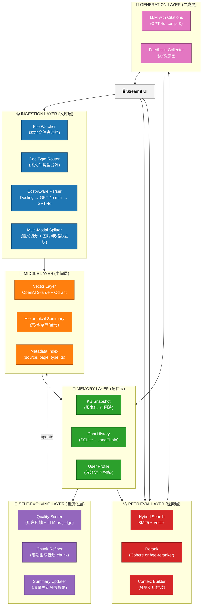
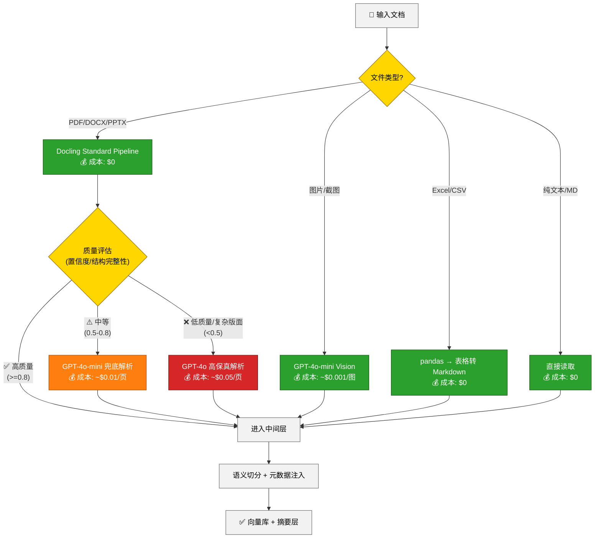
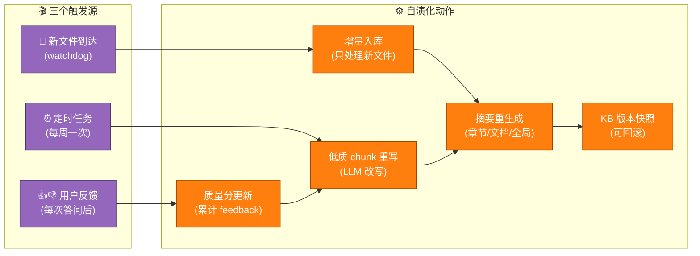

# Self-Evolving Multi-Modal Knowledge Base

## 项目计划文档 (v1.0)

> **作者**: elixxih · **日期**: 2026-05-28 · **预计周期**: 4–6 周  
> **目标受众**: 个人开发 → 部门演示 → 申请云端资源

---

## 0. TL;DR

在个人笔记本上、用 **公开数据 + 自费 API**，基于 **LangChain / LangGraph** 搭建一套具备 **自演化能力（L3 级）**、**分层中间层**、**长期记忆（含用户画像）** 的多模态 RAG 系统，4–6 周内做出可演示的 MVP，最终用 Demo 向部门申请云端部署与团队资源。

**核心创新点（用来打动决策者）**：

1. **Hybrid Cost-Aware Parser** — Docling 主力 + LLM 兜底，按"页面难度"动态路由，平均成本是纯 LLM 方案的 1/10
2. **Hierarchical Memory** — 文档摘要 / 章节摘要 / chunk 三层，RAPTOR 风格检索，"既能问细节也能问全局"
3. **Self-Refining Loop** — 用户反馈 → 低质 chunk 自动重写 → 知识库越用越聪明
4. **Reproducibility-by-Design** — KB 版本快照 + 引用溯源 + 确定性生成，每个答案都能审计

---

## 1. 需求确认（已对齐）


| 维度         | 选择             | 含义                                                |
| ---------- | -------------- | ------------------------------------------------- |
| **自演化等级**  | **L3**         | 自动入库 + 用户反馈闭环 + LLM 自我精炼（重写低质 chunk、生成摘要层、轻量知识图谱） |
| **中间层形态**  | **最佳实践组合**     | 向量层 + 分层摘要层（RAPTOR 风格）；KG 留作 v2 增强项               |
| **长期记忆范围** | **L3 (含用户画像)** | KB 持久化 + 对话历史 + 用户画像（不含历史问答反哺 KB —— 留 v2）         |
| **时间线/规模** | **标准 4–6 周**   | 给部门演示，30–100 份多模态文档                               |
| **数据合规**   | **公开数据**       | 仅用 arXiv 论文、Wikipedia、技术白皮书等；不接触任何 Ericsson 内部资料  |


---

## 2. 设计原则（贯穿始终）


| 原则                           | 具体做法                                         |
| ---------------------------- | -------------------------------------------- |
| **Cost-Aware**               | 每一步都有"廉价默认 / 升级路径"；监控每文档/每问答成本，给出$/doc 仪表盘   |
| **Reproducible**             | LLM 温度=0；embedding/LLM 模型版本钉死；KB 快照可回滚；答案带引用 |
| **Multi-Modal**              | 文字 / 表格 / 公式 / 图片 / 截图 全部进入统一中间层             |
| **Self-Evolving**            | 三个反馈源：新文档自动入库 / 用户点赞点踩 / 定期 LLM 精炼           |
| **Local-First, Cloud-Ready** | 本地能完整跑通；关键依赖用配置层解耦，迁公司云只改 env                |
| **Observable**               | 全链路 LangSmith trace；每个决策点都能下钻看原因             |


---

## 3. 系统总体架构




---

## 4. 技术栈选型（带理由）


| 层                  | 选型                                           | 替代                   | 选型理由                                             |
| ------------------ | -------------------------------------------- | -------------------- | ------------------------------------------------ |
| **包管理**            | `uv`                                         | poetry / pip         | 10× 速度，2026 年事实标准                                |
| **编排框架**           | `langchain` + `langgraph`                    | LlamaIndex           | LangGraph 用 stateful graph 表达自演化循环更自然            |
| **文档解析（主）**        | `docling`                                    | unstructured         | 你已熟悉，本地零成本，VLM pipeline 可选                       |
| **文档解析（兜底）**       | `gpt-4o-mini` (LLM-as-parser)                | gpt-4o               | 比 4o 便宜 30×，对中等难度页面够用                            |
| **难页升级**           | `gpt-4o` (vision)                            | claude-3.5-sonnet    | OpenAI vision 单价更低                               |
| **Embedding**      | `text-embedding-3-large` (3072d)             | bge-large            | OpenAI SOTA，便宜，多语言强                              |
| **向量库**            | `Qdrant` (Docker 本地)                         | Chroma / FAISS       | 支持元数据过滤、增量更新、混合搜索、易迁云（Qdrant Cloud）              |
| **关键字索引**          | `BM25` (`rank-bm25` 库)                       | Elasticsearch        | 太轻量，本地零部署                                        |
| **Rerank**         | `Cohere Rerank v3` (前 1K/月免费)                | bge-reranker-v2 (本地) | 前期 API，后期切本地                                     |
| **生成 LLM**         | `gpt-4o` + `claude-3.5-sonnet`（对比评测）         | —                    | 双模型评测找最优                                         |
| **对话/Profile 持久化** | `SQLite` + LangChain `SQLChatMessageHistory` | Postgres             | Demo 阶段够用，Postgres 留作迁云时升级                       |
| **追踪/可观测**         | `LangSmith` (免费版)                            | Langfuse             | 与 LangChain 原生集成最强                               |
| **评测**             | `RAGAs`                                      | TruLens              | RAGAs 指标更标准                                      |
| **UI**             | `Streamlit`                                  | Gradio / Chainlit    | 最快出 demo，文档上传/对话/反馈三合一                           |
| **部署**             | `Docker Compose`                             | k8s                  | Demo 阶段 compose 足够，含 app + Qdrant + Postgres(后期) |
| **配置**             | `pydantic-settings` + `.env`                 | —                    | 环境隔离（dev/staging/prod）                           |


---

## 5. Cost-Aware 解析路由（核心创新）

这是把"LLM-as-parser"和"工具"结合起来的核心机制。




**质量评估信号**（决定是否升级）：

- Docling 输出的 `confidence` 字段
- 表格识别失败次数
- 页面图片占比 > 50%
- 提取文本 token 数 / 页面面积 比值异常低（暗示 OCR 失败）
- 公式/化学式正则匹配失败

**预算约束**：

- 单文档解析成本 > $0.5 直接报警
- 月度自费预算 < $80（个人可承受）

---

## 6. 中间层详细设计

### 6.1 三层结构

```
全局摘要 (Global Summary)
    └── 文档摘要 (Document Summary) [每文档 1 条]
            └── 章节摘要 (Section Summary) [每章 1 条]
                    └── Chunk (语义切分块) [256~512 tokens]
```

每一层都独立 embedding 入库，**检索时根据问题类型选择层级**：


| 用户提问类型         | 主检索层                     |
| -------------- | ------------------------ |
| "X 的具体定义是什么"   | Chunk 层（细粒度）             |
| "这份报告的主要观点"    | Document Summary 层       |
| "我们文档库整体在讲什么"  | Global Summary 层         |
| "比较 A 和 B 的不同" | Document Summary + 跨文档检索 |


### 6.2 元数据 Schema

每个 chunk 必带的元数据：

```python
{
    "chunk_id": "uuid",
    "source_doc_id": "doc_uuid",
    "source_path": "/data/raw/papers/attention.pdf",
    "doc_type": "pdf",
    "page": 5,
    "section": "3.2 Multi-Head Attention",
    "modal_type": "text|table|formula|image",
    "parser_used": "docling|gpt-4o-mini|gpt-4o",
    "parser_cost_usd": 0.012,
    "content_hash": "sha1",
    "ingested_at": 1717834567,
    "kb_version": "v1.2.0",
    "quality_score": 0.87,
    "feedback_score": 0.0  # 用户反馈累加
}
```

`kb_version` 是**可复现性**的关键 —— 每次 KB 有结构性变更时打 tag。

---

## 7. 自演化机制（L3）




**触发器实现**：


| 触发器  | 实现方式                          | 频率    |
| ---- | ----------------------------- | ----- |
| 新文件  | `watchdog` 监听 `data/raw/`     | 实时    |
| 用户反馈 | UI 点赞点踩按钮，写入 `feedback_log` 表 | 实时    |
| 定时任务 | `APScheduler` + LangGraph 调度图 | 每周日凌晨 |


**Chunk Refiner 工作逻辑**：

1. 找出 `feedback_score < -2` 或 `quality_score < 0.5` 的 chunk
2. 取出原始上下文（前后各一个 chunk）
3. 让 `gpt-4o-mini` 改写："用更清晰的语言重新表达这段内容，保持事实不变"
4. 改写后跑一致性检测（LLM-as-judge 对比新旧版本）
5. 通过检测 → 替换；不通过 → 标记 `needs_human_review`
6. 旧 chunk 不删，移到 `archive/` 子集合（保证可回溯）

---

## 8. 记忆层详细设计

### 8.1 三种记忆


| 类型        | 存哪                               | 内容                               | 用途         |
| --------- | -------------------------------- | -------------------------------- | ---------- |
| **KB 长期** | Qdrant + SQLite                  | chunks / summaries / metadata    | RAG 检索     |
| **对话记忆**  | SQLite (`chat_history` 表)        | session_id / user / message / ts | 多轮对话 / 上下文 |
| **用户画像**  | SQLite (`user_profile` 表) + JSON | 兴趣领域 / 常问题型 / 偏好答案风格             | 个性化检索 / 答案 |


### 8.2 用户画像怎么生成（轻量化）

不搞复杂的 RLHF，简单做法：

1. 每 N=10 个问答后，让 `gpt-4o-mini` 总结："这个用户最近关心什么领域、问题风格是什么"
2. 结果存到 `user_profile.summary` 字段
3. 下次提问时，把 profile 拼进 system prompt：
  > "用户画像：{profile.summary}。请用符合这个画像的风格回答。"

成本约 $0.001 / 用户 / 10 问，可忽略。

### 8.3 对话历史进检索

LangChain 的 `ConversationalRetrievalChain` 模式：

1. 用户新问题 + 历史对话 → LLM 改写为"独立问题"
2. 独立问题 → 向量检索
3. 检索结果 + 历史对话 + 新问题 → 最终 LLM 生成

---

## 9. 可复现性保障（被低估的关键点）


| 机制          | 实现                                                                                        |
| ----------- | ----------------------------------------------------------------------------------------- |
| **生成确定性**   | `temperature=0`, `seed=42` (gpt-4o 已支持)                                                   |
| **嵌入版本钉死**  | 配置文件锁定 `text-embedding-3-large@2024-01-25`                                                |
| **KB 版本快照** | 每次结构性更新 → Qdrant snapshot + SQLite dump 打包到 `snapshots/v{x.y.z}/`                         |
| **答案审计日志**  | 每个回答都记录：`{question, retrieved_chunks: [ids], llm_call_id, kb_version, answer, timestamp}` |
| **引用强制**    | Prompt 强制 `[source · page]` 格式；后处理校验是否含引用                                                 |
| **回归测试集**   | 维护 20 个 golden Q&A，每次 KB 更新自动跑 RAGAs                                                      |


`kb_version` 一旦确定，给定 `{question, kb_version}` 必然产出相同答案 —— 这是**可复现的形式化定义**。

---

## 10. 6 周路线图（带交付物）

### 📅 Week 0: 准备期（3 天，跟周一并行）


| 任务                                                             | 交付物                |
| -------------------------------------------------------------- | ------------------ |
| 笔记本环境检查（Python 3.11+, Docker, VS Code/Cursor）                  | 环境清单               |
| 注册账号：OpenAI（充值 $20）、Anthropic（充值 $20）、Cohere（免费）、LangSmith（免费） | API key 入 `.env`   |
| 项目仓库初始化（git, uv, pyproject.toml）                               | 空架构 + README       |
| 公开数据集准备（20 份初始 PDF）                                            | `data/raw/v0/`     |
| Qdrant Docker 容器 + SQLite 初始化                                  | docker-compose.yml |


### 📅 Week 1: MVP - 最小可用

**目标**：单文档 → 检索 → 回答闭环


| 任务                                                        | 交付物                                  |
| --------------------------------------------------------- | ------------------------------------ |
| Docling 接入：PDF → DoclingDocument                          | `src/parsers/docling_parser.py`      |
| 简单切分（按章节 + 滑窗）                                            | `src/splitters/semantic_splitter.py` |
| OpenAI Embedding → Qdrant 入库                              | `src/stores/qdrant_store.py`         |
| 简单 RAG chain（无 rerank）                                    | `src/chains/basic_rag.py`            |
| CLI 测试入口：`python -m src.cli ingest <pdf>` / `query "..."` | `src/cli.py`                         |
| **演示效果**："我能问 attention paper 的具体内容了"                     | 短视频 30s                              |


### 📅 Week 2: 多模态 + 成本路由

**目标**：图片/表格/公式全部进 KB；解析成本可见


| 任务                                             | 交付物                            |
| ---------------------------------------------- | ------------------------------ |
| Cost-Aware Parser Router（Docling → mini → 4o）  | `src/parsers/router.py`        |
| Vision LLM 图片描述（结构化 prompt）                    | `src/parsers/vision_parser.py` |
| Excel/CSV → Markdown 表格                        | `src/parsers/table_parser.py`  |
| 元数据 schema 落地 + Qdrant payload 索引              | `src/schemas/chunk.py`         |
| 成本统计仪表盘（每文档/累计）                                | `src/metrics/cost_tracker.py`  |
| **演示效果**："Transformer 那张架构图它能解释了"，"成本花了 $0.13" | demo notebook                  |


### 📅 Week 3: 检索质量优化

**目标**：从"能查到"到"查得准"


| 任务                                        | 交付物                               |
| ----------------------------------------- | --------------------------------- |
| BM25 索引 + 混合检索                            | `src/retrievers/hybrid.py`        |
| Cohere Rerank 接入                          | `src/retrievers/rerank.py`        |
| Contextual Retrieval（Anthropic 那个方法）      | `src/processors/contextualize.py` |
| 引用强制 + 后处理校验                              | `src/postprocess/citation.py`     |
| Golden Q&A 评测集（20 条） + RAGAs 跑通           | `tests/eval/`                     |
| **演示效果**：检索准确率从 ~60% → 85%+（用 RAGAs 量化展示） | 评测报告                              |


### 📅 Week 4: 中间层 + 自演化

**目标**：从静态 KB → 自演化 KB


| 任务                                       | 交付物                               |
| ---------------------------------------- | --------------------------------- |
| 分层摘要（章节/文档/全局）生成 + 入库                    | `src/summarizers/hierarchical.py` |
| 检索时多层路由                                  | `src/retrievers/multi_level.py`   |
| Watchdog 文件夹监控 + 增量入库                    | `src/ingestion/watcher.py`        |
| Feedback 表 + 评分累积                        | `src/feedback/`                   |
| Chunk Refiner（定时任务版）                     | `src/evolution/refiner.py`        |
| **演示效果**：扔进新 PDF → 30s 后能问；点踩之后下次再问，答案变好 | demo gif                          |


### 📅 Week 5: 记忆 + UI

**目标**：从"工具"到"产品"


| 任务                                         | 交付物                     |
| ------------------------------------------ | ----------------------- |
| 对话历史持久化（SQLite + LangChain）                | `src/memory/chat.py`    |
| 用户画像生成（每 10 问）                             | `src/memory/profile.py` |
| Streamlit UI：上传 / 对话 / 引用展开 / 反馈 / KB 版本切换 | `app.py`                |
| LangSmith 全链路 trace 打通                     | env 配置                  |
| KB 版本快照机制                                  | `src/versioning/`       |
| **演示效果**：能像 ChatGPT 一样上传文件后对话，每个答案能点开引用    | 完整 UI                   |


### 📅 Week 6: 打磨 + 演示准备

**目标**：从"能用"到"敢演示"


| 任务                          | 交付物                        |
| --------------------------- | -------------------------- |
| Docker Compose 一键启动         | `docker-compose.yml`       |
| 文档：README + 架构图 + 迁移到公司云的方案 | `docs/`                    |
| Demo 脚本（5 个 wow moments）    | `demo/demo_script.md`      |
| 备用问题清单（防止现场翻车）              | `demo/safe_questions.json` |
| 录制 3 分钟 demo 视频             | `demo/walkthrough.mp4`     |
| **里程碑**：约部门 30 分钟分享         | PPT + 现场演示                 |


---

## 11. 项目目录结构（建议）

> ⚠️ 注意：**项目代码放在本地个人盘**，比如 `D:\projects\self-evolving-kb\`  
> **不要**放在 OneDrive Ericsson 文件夹里（避免和公司数据混淆，也避免同步冲突）

```
self-evolving-kb/
├── pyproject.toml              # uv 项目定义
├── uv.lock
├── .env.example                # API keys 模板（不提交）
├── .gitignore
├── docker-compose.yml          # Qdrant + (后期) Postgres
├── README.md
├── PROJECT_PLAN.md             # 本文档（可拷贝过去）
│
├── src/
│   ├── __init__.py
│   ├── config.py               # pydantic-settings
│   │
│   ├── parsers/                # 解析层
│   │   ├── docling_parser.py
│   │   ├── vision_parser.py
│   │   ├── table_parser.py
│   │   └── router.py           # cost-aware routing
│   │
│   ├── splitters/              # 切分层
│   │   └── semantic_splitter.py
│   │
│   ├── summarizers/            # 摘要层
│   │   └── hierarchical.py
│   │
│   ├── stores/                 # 存储层
│   │   ├── qdrant_store.py
│   │   └── sqlite_store.py
│   │
│   ├── retrievers/             # 检索层
│   │   ├── hybrid.py           # BM25 + vector
│   │   ├── rerank.py
│   │   └── multi_level.py
│   │
│   ├── memory/                 # 记忆层
│   │   ├── chat.py
│   │   └── profile.py
│   │
│   ├── evolution/              # 自演化层
│   │   ├── watcher.py
│   │   ├── refiner.py
│   │   └── scheduler.py
│   │
│   ├── chains/                 # LangChain/Graph 编排
│   │   ├── basic_rag.py
│   │   ├── conversational_rag.py
│   │   └── evolution_graph.py  # LangGraph
│   │
│   ├── postprocess/
│   │   └── citation.py
│   │
│   ├── metrics/
│   │   └── cost_tracker.py
│   │
│   ├── versioning/
│   │   └── snapshot.py
│   │
│   ├── feedback/
│   │   └── collector.py
│   │
│   └── cli.py
│
├── app.py                      # Streamlit UI 入口
│
├── data/
│   ├── raw/                    # 原始文档（按版本分目录）
│   │   ├── v0/                 # Week 0 初始集
│   │   ├── v1/                 # Week 2 扩展
│   │   └── ...
│   ├── processed/              # 解析中间结果（缓存）
│   └── snapshots/              # KB 版本快照
│       ├── v0.1.0/
│       └── ...
│
├── tests/
│   ├── unit/
│   ├── integration/
│   └── eval/                   # RAGAs 评测
│       ├── golden_qa.jsonl
│       └── run_eval.py
│
├── notebooks/                  # 实验/调研
│   ├── 01_docling_exploration.ipynb
│   ├── 02_cost_routing_test.ipynb
│   └── ...
│
├── docs/
│   ├── architecture.md
│   ├── migration_to_corp_cloud.md
│   └── demo_script.md
│
└── demo/
    ├── safe_questions.json
    └── walkthrough.mp4
```

---

## 12. 公开数据集推荐（Week 0 准备用）

要选**含文字/表格/公式/图片混合**的，才能展示多模态能力：


| 数据源                                  | 内容                         | 数量建议 | 多模态丰富度 |
| ------------------------------------ | -------------------------- | ---- | ------ |
| **arXiv 论文** (cs.AI / cs.LG / cs.CL) | 公式 + 图表 + 引用密集             | 15 份 | ⭐⭐⭐⭐⭐  |
| **NIPS/ICML 经典论文**                   | Transformer / BERT / GPT 等 | 5 份  | ⭐⭐⭐⭐⭐  |
| **3GPP/IEEE 公开标准**                   | 表格 + 流程图 + 长文档             | 5 份  | ⭐⭐⭐⭐   |
| **NVIDIA/Anthropic 技术博客 PDF**        | 图文混排好看                     | 5 份  | ⭐⭐⭐⭐   |
| **WHO/世界银行公开报告**                     | 大量表格 + 图表                  | 5 份  | ⭐⭐⭐⭐   |
| **Wikipedia 长条目 (导出 PDF)**           | 纯文字 + 部分图片                 | 5 份  | ⭐⭐⭐    |
| **公开财报 PDF**（Apple/MSFT 10-K）        | 表格密集 + 法律语言                | 3 份  | ⭐⭐⭐⭐   |
| **截图 / 流程图 PNG**                     | 测试 vision 能力               | 10 张 | ⭐⭐⭐⭐⭐  |


**建议起步集**: 5 篇 arXiv + 3 篇 3GPP + 2 篇技术博客 = 10 篇，刚好够 Week 1。

---

## 13. 成本预算（自费部分）

### 13.1 单次完整建库成本估算（100 份文档）


| 项目                       | 单价           | 用量       | 小计        |
| ------------------------ | ------------ | -------- | --------- |
| Docling 解析（本地）           | $0           | 100 docs | $0        |
| gpt-4o-mini 兜底（估 20% 文档） | $0.01/页      | ~400 页   | $4        |
| gpt-4o 难页升级（估 5%）        | $0.05/页      | ~100 页   | $5        |
| Vision 图片描述              | $0.001/图     | ~300 图   | $0.3      |
| Embedding (3-large)      | $0.13/1M tok | ~2M tok  | $0.26     |
| Cohere Rerank (前 1K 免费)  | -            | -        | $0        |
| **建库总计**                 |              |          | **≈ $10** |


### 13.2 每月运行成本


| 项目                                     | 估算           |
| -------------------------------------- | ------------ |
| 重建 KB × 2 次（迭代）                        | $20          |
| Demo / 测试问答 × 500 次 (gpt-4o, ~$0.05/次) | $25          |
| Contextual Retrieval 处理                | $5           |
| 自演化精炼 (gpt-4o-mini)                    | $5           |
| LangSmith / Qdrant / SQLite            | $0（都用免费档）    |
| **月度小计**                               | **≈ $55–65** |


### 13.3 预算告警机制

- 每天跑完 ingest 后打印当日累计 $
- 月度超过 $80 → 自动暂停 vision 升级（降级到 mini）
- 单文档超过 $0.5 → 写日志高亮 + 邮件提醒

---

## 14. 风险与缓解


| 风险                   | 概率  | 影响  | 缓解措施                                           |
| -------------------- | --- | --- | ---------------------------------------------- |
| 数据合规误用（不小心用了内部资料）    | 低   | 极高  | 项目放本地盘 / 代码 grep 检查 / 每周 review 一次 `data/raw/` |
| 笔记本性能不足（Docling 太慢）  | 中   | 中   | 准备小数据集；必要时用 RunPod 临时 GPU                      |
| API 成本失控             | 低   | 中   | 预算告警 + 月度上限硬性截断                                |
| 第 4 周自演化复杂度爆炸        | 中   | 中   | 复杂功能（如 KG）严格放 v2，MVP 路径上只做"重写+摘要更新"            |
| 演示翻车（现场问题答不好）        | 中   | 高   | 准备 `safe_questions.json`；演示前同事帮 dry-run        |
| LangChain 版本升级破坏 API | 中   | 低   | `pyproject.toml` 钉死小版本                         |
| Demo 后申请资源被拒         | 中   | 中   | 计划文档/迁移文档/ROI 数据三件套提前准备                        |


---

## 15. 演示策略（给部门看时怎么打动他们）

5 个 **Wow Moments**（按演示顺序）：

1. **上传一份新 arXiv 论文** → 30 秒后开始问问题（**对比公司 Langflow 半小时还在配节点**）
2. **问一个图片相关的问题**（"Transformer 架构图里 K/V/Q 是怎么连的？"）→ 系统从图描述里精准回答
3. **问一个跨文档问题**（"BERT 和 GPT 在预训练目标上有什么不同？"）→ 系统从两个文档分层摘要中综合回答
4. **故意点踩一个答案** → 下次再问同样问题 → 答案明显变好（**展示自演化**）
5. **切换 KB 版本到一周前** → 同样问题，答案明显变差（**展示可复现 + 版本控制**）

**结尾 slide**："**这套系统 4 周内、$50 个人成本搭出来。给公司云资源 6 周可以服务 50 人，给 12 周可以服务 500 人。**"

---

## 16. 后续迁移到公司云的路径（提前留接口）


| 本地 Demo                       | 公司云生产                                   | 切换难度                   |
| ----------------------------- | --------------------------------------- | ---------------------- |
| OpenAI gpt-4o                 | EricAI 内部 LLM                           | ⭐⭐ 改 env / model name  |
| OpenAI text-embedding-3-large | EricAI Embeddings                       | ⭐⭐ 改 env / 重新 embed 全量 |
| Qdrant Docker (本地)            | Qdrant Cloud / 公司 Astra / 自建            | ⭐ Qdrant API 兼容性强      |
| SQLite                        | Postgres (公司云 RDS)                      | ⭐⭐ schema 兼容           |
| Streamlit (本地)                | Streamlit on Azure App Service / 公司容器平台 | ⭐⭐⭐                    |
| 个人 LangSmith                  | 公司自建 Langfuse 或私有 LangSmith             | ⭐⭐                     |
| 公开数据                          | 公司内部数据（合规审批后）                           | 业务流程，非技术               |


**关键设计**：用 `config.py` + `.env` 把 provider 切换抽象掉，理论上**改 5 行配置就能跑公司云**。

---

## 17. 立即可以开始的 3 件事（Week 0 Day 1）

下面是从现在到明天可以推进的具体动作：

1. **决定项目位置**：在 `D:\projects\` 或类似**本地盘**新建 `self-evolving-kb` 文件夹（**不要放 OneDrive**）
2. **注册账号 + 充值**：
  - OpenAI Platform（充 $20）
  - Anthropic Console（充 $20，可选，作为 LLM 对比备份）
  - Cohere（免费注册，拿 trial key）
  - LangSmith（用 GitHub 登录免费版）
3. **下载首批数据**：去 arXiv 下载 5 篇感兴趣的 CS 论文（推荐 Attention Is All You Need, BERT, GPT-3, RAG, RAPTOR）放到 `data/raw/v0/`

---

## 18. 服务清单 / API 总览

> 一站式清单。本节回答："这个项目我到底要注册和付费哪些东西？"

### 18.1 必需服务（不注册项目跑不起来）


| 服务                  | 用途                                            | 何时启用     | 注册地址                | 推荐充值       | 计费方式            |
| ------------------- | --------------------------------------------- | -------- | ------------------- | ---------- | --------------- |
| **OpenAI Platform** | gpt-4o / gpt-4o-mini / text-embedding-3-large | Week 1 起 | platform.openai.com | **$20 起步** | 预付费余额，按 token   |
| **LangSmith**       | 全链路追踪与调试                                      | Week 1 起 | smith.langchain.com | **免费**     | 个人版 5K traces/月 |


### 18.2 推荐服务（Demo 体验显著提升）


| 服务                    | 用途                       | 何时启用      | 注册地址                  | 推荐充值       | 计费方式          |
| --------------------- | ------------------------ | --------- | --------------------- | ---------- | ------------- |
| **Cohere**            | Rerank v3（检索重排）          | Week 3    | cohere.com            | **免费**     | 前 1,000 次/月免费 |
| **Anthropic Console** | Claude 3.5 Sonnet（双模型评测） | Week 3 评测 | console.anthropic.com | **$10 起步** | 按 token       |


### 18.3 可选服务（锦上添花）


| 服务                       | 用途                             | 何时考虑    | 注册地址            | 备注                           |
| ------------------------ | ------------------------------ | ------- | --------------- | ---------------------------- |
| **Qdrant Cloud**         | 向量库托管（替代本地 Docker）             | 迁云阶段    | cloud.qdrant.io | 免费档 1GB；Demo 阶段建议先用本地 Docker |
| **GitHub**               | 代码托管 / Issue 管理                | Week 0  | github.com      | 免费私有仓                        |
| **RunPod / Lambda Labs** | 临时租 GPU 跑 Docling VLM pipeline | 仅个别复杂文档 | runpod.io       | 按小时，$0.4~2/h                 |


### 18.4 完全本地（零注册零账号）


| 组件            | 安装方式                    | 资源占用                |
| ------------- | ----------------------- | ------------------- |
| **Docling**   | `pip install docling`   | 首次下载 ~2GB 模型        |
| **Qdrant**    | `docker compose up`     | ~500MB 内存           |
| **SQLite**    | Python 内置               | 数 MB                |
| **BM25**      | `pip install rank-bm25` | 内存级                 |
| **Streamlit** | `pip install streamlit` | 本机 `localhost:8501` |


### 18.5 资金流向一图看清

```
你的钱包 ($30 起)
   │
   ├── OpenAI 余额 ($20)
   │     ├── gpt-4o-mini ──────── 兜底解析 / Contextual Retrieval / 用户画像
   │     ├── gpt-4o ───────────── 难页解析 / 最终答案 / Vision 图片描述
   │     └── text-embedding-3-large ─ 文档/查询向量化
   │
   ├── Anthropic 余额 ($10, 可选)
   │     └── Claude 3.5 Sonnet ── Week 3 评测对比用
   │
   └── 免费配额（不花钱）
         ├── LangSmith ───── 追踪/调试
         ├── Cohere Rerank ─ 检索重排（前 1K/月）
         └── 本地服务 ─────── Docling / Qdrant / SQLite / Streamlit
```

### 18.6 .env 模板

把所有 API key 集中放在项目根目录 `.env` 文件（**加入 .gitignore，绝不提交**）：

```bash
# === LLM Providers ===
OPENAI_API_KEY=sk-...
ANTHROPIC_API_KEY=sk-ant-...     # 可选（评测用）

# === Retrieval ===
COHERE_API_KEY=...                # 可选（Rerank）

# === Observability ===
LANGCHAIN_API_KEY=ls-...
LANGCHAIN_TRACING_V2=true
LANGCHAIN_PROJECT=self-evolving-kb

# === Local Services ===
QDRANT_URL=http://localhost:6333
SQLITE_PATH=./data/app.db

# === Cost Guards ===
MONTHLY_BUDGET_USD=80
PER_DOC_BUDGET_USD=0.5
```

### 18.7 注册顺序建议（Week 0 Day 1 一次性搞定）


| 顺序  | 服务              | 用时                 | 备注                  |
| --- | --------------- | ------------------ | ------------------- |
| 1   | GitHub          | 5 min              | 代码托管                |
| 2   | OpenAI Platform | 10 min + 充值到账延迟    | 必充 $20              |
| 3   | LangSmith       | 2 min（用 GitHub 登录） | 拿 LANGCHAIN_API_KEY |
| 4   | Cohere          | 5 min              | 拿 trial key 备用      |
| 5   | Anthropic       | 5 min              | 不急，Week 3 前注册即可     |


总用时：**Day 1 半小时内全部搞定**（不含 OpenAI 充值到账延迟，一般几分钟）。

### 18.8 月度成本警戒线（双重保险）


| 累计花费 | 自动行动                             |
| ---- | -------------------------------- |
| $50  | 邮件提醒：复盘成本结构                      |
| $80  | 自动降级：vision 升级关闭，全部走 gpt-4o-mini |
| $100 | 暂停所有自动化任务 + 人工 review            |


---

## 19. 待补充 / 待决策项（v1.1 再敲定）

这些不影响 Week 1 起步，但 Week 3 前需要回答：

- 是否需要支持中文文档？（影响 embedding 选型）
- 是否需要本地 LLM 兜底（Ollama）作为完全离线方案？
- UI 是否需要支持多用户登录？（v1 默认单用户）
- 知识图谱（KG）确定放 v2 还是 v1.5 中期插入？
- 是否需要把"历史 Q&A"沉淀回 KB？（选项 D，当前未选）

---

## 20. 我（AI 助手）能持续帮你做什么

后续 6 周我可以参与的工作：


| 周期         | 我能提供                          |
| ---------- | ----------------------------- |
| **每周开始**   | 当周任务拆解 + 关键代码骨架               |
| **写代码时**   | 实时 pair programming（你写一段我审一段） |
| **遇到 bug** | 日志/堆栈分析、调试建议                  |
| **架构决策**   | 选型对比、trade-off 分析             |
| **演示前**    | Demo 脚本润色、备用问题清单、PPT 内容       |
| **迁移规划**   | 公司云迁移方案文档                     |


---

## 附录 A: 一句话目标

> **在 6 周内、用 < $100 的自费成本，在本地笔记本上做出一个能让部门 leader 看完说"这就是我们需要的"的多模态自演化知识库 Demo，并以此为筹码申请云端资源支持团队级使用。**

---

**文档版本**: v1.1 · 2026-05-28  
**修订记录**:

- v1.0 (2026-05-28) 初始版本
- v1.1 (2026-05-28) 新增 §18 服务清单 / API 总览；原 §18/§19 顺延为 §19/§20

**下次修订触发**: Week 1 结束 / 任何需求变更